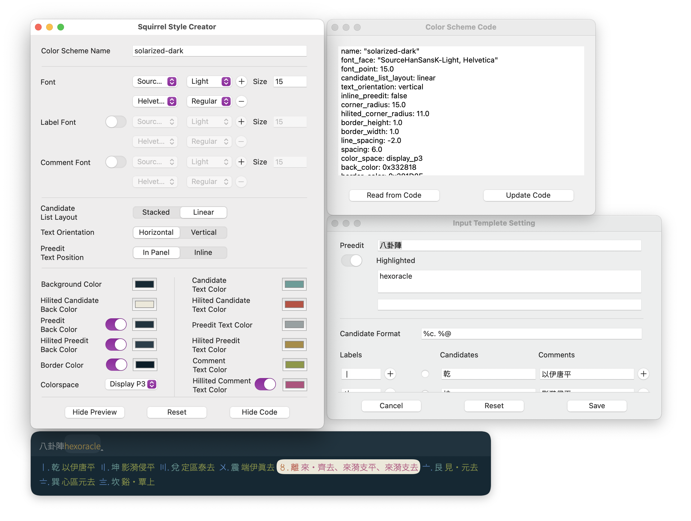

## Preview [Squirrel](https://rime.im) color scheme

* Get correct font name from font picker
* Use system color picker to get correct color
* Instant preview
* Customizable input candidates
* Auto-generate code
* Load color scheme from code

You can also download from [Mac App Store](https://apps.apple.com/app/squirrel-designer/id1530616498)

Preview:

*Requires macOS 13.0+*
*This app does not collect any user data*
